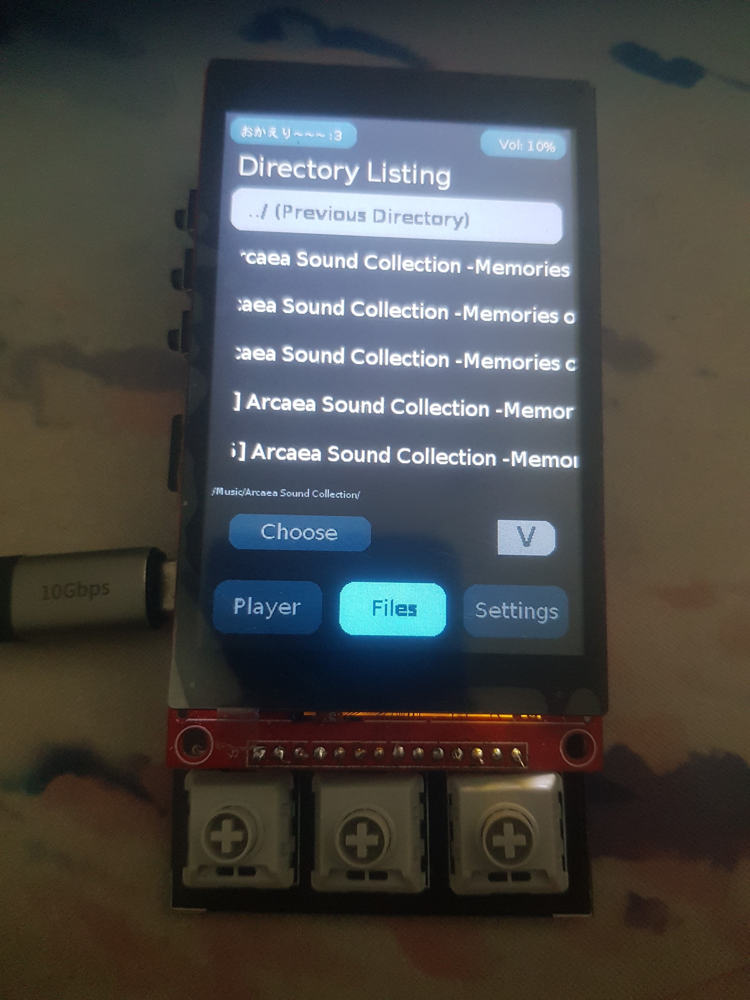
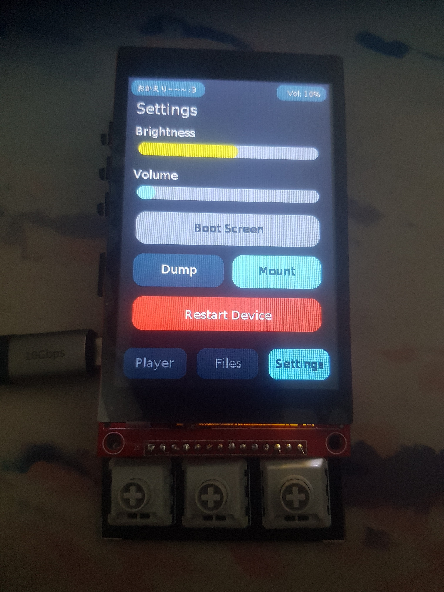

# Yet another Audio Player

> [!CAUTION]
> For now, DO NOT USE the PCB Design unless you know what you are doing
> There are quite a silly (and a bit major) design flaws on there

> [!NOTE]  
> For now, the audio handling is a bit stuttery on some FLAC audio
> (especially on 24 bit one). I will make it a todo list for now

Basically it is a rewrite version of the previous project of mine [uta](https://github.com/petorikooru/uta)

I create this to fulfill my final project of Microcomputer class lmao.

## Dependencies

- TFT_eSPI + FT6236 + PNGdec
- arduino-audio-tools + libfoxenflac + libmp3helix + libaac + libwav
- SdFat

## Hardware Components

- ILI9488 Capacitive Touch Screen Display
- PCM5102a DAC
- MicroSD Card Module
- ESP32-S3 V2
- Kailh Choc v2 switch
- Other small components stuff

## Screenshot

<table>
  <tr>
    <td> </td>
    <td> </td>
    <td> </td>
  </tr> 
</table>

## TODO List

- Make the audio a task itself just like Display
- Actually handle audio cover image (jpg and png)
- More performance fixing stuff
- Actually handle UI correctly instead of reloading from scratch
